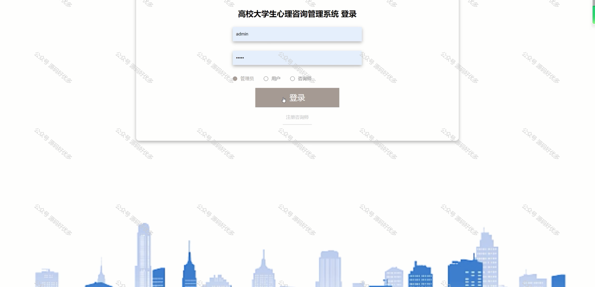
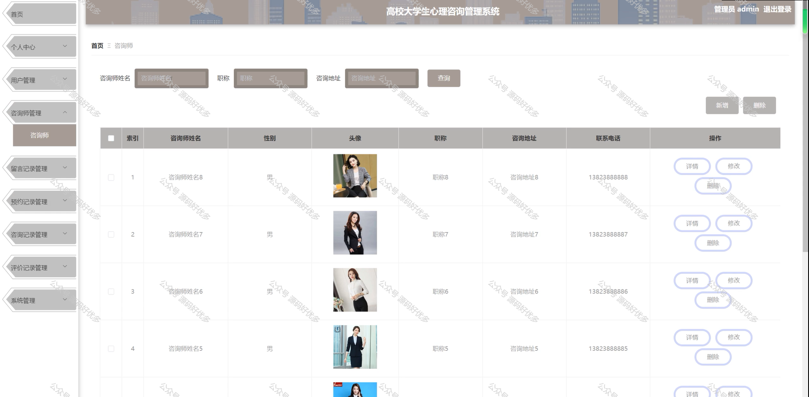

 
## 查看主页获取源码

### 一、作品包含

源码+数据库+设计文档万字+PPT+全套环境和工具资源+部署教程

### 二、项目技术

前端技术：Html、Css、Js、Vue、Element-ui

数据库：MySQL

后端技术：Java、Spring Boot、MyBatis

  

### 三、运行环境

开发工具：IDEA/eclipse

数据库：MySQL5.7

数据库管理工具：Navicat10以上版本

环境配置软件： JDK1.8+Maven3.6.3

前端Nodejs：14

### 四、项目介绍
项目编号：springbootA160

高校大学生心理咨询管理系统的背景在于应对大学生心理健康问题的日益突出，以及心理咨询服务的需求增长。随着社会竞争的加剧和大学生心理压力的增大，心理健康教育和咨询服务的重要性日益凸显。传统的心理咨询管理方式难以满足大量学生的需求，且缺乏有效的跟踪和管理手段。因此，构建一个专业的心理咨询管理系统对于提高高校心理咨询服务的效率和质量，保障学生心理健康，具有重要的现实意义和长远影响。

前台用户功能：首页、咨询师、公告信息、后台管理和个人中心。

后台分为管理员、用户、咨询师
管理员的功能：首页、个人中心、用户管理、咨询师管理、留言记录管理、预约记录管理、咨询记录管理、评价记录管理、系统管理。
用户的功能：首页、个人中心、留言记录管理、预约记录管理、咨询记录管理、评价记录管理。
咨询师的功能：首页、个人中心、留言记录管理、预约记录管理、咨询记录管理、评价记录管理。

### 五、运行截图

  

